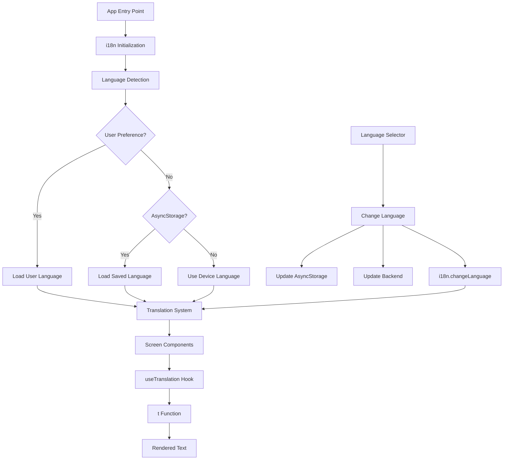
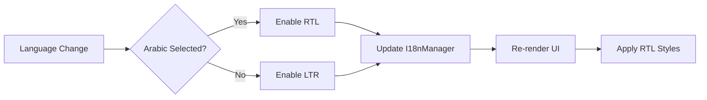

# Design Document: Complete App Internationalization

## Overview

This design document outlines the technical approach for completing internationalization (i18n) across the LinkUp mobile application. The system will enable users to interact with the application in 12 supported languages by completing translation files and systematically integrating translation keys throughout all screens and components.

### Current State

The application has a solid i18n foundation:
- i18next and react-i18next configured in `lib/i18n.ts`
- 12 language files exist in `locales/` directory
- English (en.json) and Spanish (es.json) are complete with ~200 translation keys
- Settings screen serves as reference implementation
- Backend supports language preference storage via User schema
- `useLanguage` hook initializes language on app start

### Goals

1. Complete all 10 remaining translation files (fr, de, zh, ja, ko, ar, pt, ru, hi, it)
2. Systematically integrate translations into all screens and components
3. Implement RTL support for Arabic
4. Establish translation key naming conventions and validation
5. Support dynamic value interpolation and pluralization
6. Ensure performance and accessibility compliance

### Design Principles

- **Completeness**: Every user-facing string must use translation keys
- **Consistency**: Uniform translation key structure across the application
- **Performance**: Instant language switching without network requests
- **Maintainability**: Clear patterns for adding new translations
- **Accessibility**: Screen reader support in all languages

## Architecture

### System Components



### Translation Flow

1. **App Initialization**: `_layout.tsx` initializes i18n before rendering
2. **Language Detection**: `useLanguage` hook determines initial language
3. **Component Rendering**: Components use `useTranslation()` hook
4. **Text Retrieval**: `t('key.path')` function retrieves translated text
5. **Language Switching**: User selection triggers `i18n.changeLanguage()`
6. **Persistence**: Language preference saved to AsyncStorage and backend

### RTL Support Architecture



## Components and Interfaces

### Translation System Interface

```typescript
// i18n configuration
interface I18nConfig {
  resources: Record<string, { translation: TranslationFile }>;
  lng: string;
  fallbackLng: string;
  compatibilityJSON: 'v4';
  interpolation: {
    escapeValue: boolean;
  };
}

// Translation file structure
interface TranslationFile {
  common: CommonTranslations;
  auth: AuthTranslations;
  wallet: WalletTranslations;
  feed: FeedTranslations;
  profile: ProfileTranslations;
  settings: SettingsTranslations;
  security: SecurityTranslations;
  twoFactor: TwoFactorTranslations;
  chat: ChatTranslations;
  notifications: NotificationsTranslations;
  search: SearchTranslations;
  errors: ErrorTranslations;
}

// useTranslation hook interface
interface UseTranslationReturn {
  t: (key: string, options?: TranslationOptions) => string;
  i18n: I18n;
  ready: boolean;
}

interface TranslationOptions {
  // Dynamic value interpolation
  [key: string]: string | number;
  // Pluralization
  count?: number;
  // Context
  context?: string;
}
```

### Language Selector Component

```typescript
interface Language {
  code: string;          // ISO 639-1 code (en, es, fr, etc.)
  name: string;          // English name
  nativeName: string;    // Native script name
  rtl?: boolean;         // RTL flag for Arabic
}

interface LanguageSelectorProps {
  onLanguageChange?: (languageCode: string) => void;
}
```

### Screen Component Pattern

```typescript
// Standard pattern for translated screens
function TranslatedScreen() {
  const { t } = useTranslation();
  
  return (
    <View>
      <Text>{t('section.key')}</Text>
      <Text>{t('section.dynamicKey', { username: 'John' })}</Text>
      <Text>{t('section.countKey', { count: 5 })}</Text>
    </View>
  );
}
```

## Data Models

### Translation Key Structure

Translation keys follow a hierarchical dot-notation structure:

```
section.subsection.key
```

**Sections**:
- `common`: Shared UI elements (buttons, labels, states)
- `auth`: Authentication flows (sign in, sign up, verification)
- `wallet`: Financial operations (send, receive, transactions)
- `feed`: Social feed (posts, comments, likes)
- `profile`: User profiles (bio, followers, portfolio)
- `settings`: App configuration (preferences, account)
- `security`: Security features (password, 2FA, biometric)
- `twoFactor`: Two-factor authentication specific
- `chat`: Messaging (conversations, typing indicators)
- `notifications`: Notification messages and types
- `search`: Search functionality (filters, results)
- `errors`: Error messages and validation

**Naming Conventions**:
- Use camelCase for multi-word keys: `forgotPassword`, `copyAddress`
- Be descriptive but concise: `whatsOnYourMind` not `whatAreYouThinkingAbout`
- Group related keys: `wallet.send`, `wallet.receive`, `wallet.history`

### Translation File Completion Strategy

**Phase 1: Machine Translation Base**
- Use professional translation service (Google Cloud Translation API or DeepL)
- Generate initial translations for all 10 incomplete languages
- Maintain exact JSON structure from en.json

**Phase 2: Human Review (Optional)**
- Native speakers review machine translations
- Adjust for cultural context and idioms
- Verify technical terminology

**Phase 3: Validation**
- Automated script validates structure completeness
- Check for missing keys, empty values, placeholder text
- Verify character encoding (UTF-8)

### Pluralization Rules

i18next supports language-specific pluralization:

```json
{
  "feed": {
    "likes": "{{count}} like",
    "likes_other": "{{count}} likes",
    "comments": "{{count}} comment",
    "comments_other": "{{count}} comments"
  }
}
```

**Pluralization Forms by Language**:
- English, Spanish, French, German, Italian, Portuguese: `_one`, `_other`
- Russian: `_one`, `_few`, `_many`, `_other`
- Arabic: `_zero`, `_one`, `_two`, `_few`, `_many`, `_other`
- Chinese, Japanese, Korean: No plural forms (same for all counts)

### Dynamic Value Interpolation

```json
{
  "notifications": {
    "likedYourPost": "{{username}} liked your post",
    "tippedYou": "{{username}} tipped you {{amount}} SOL"
  }
}
```

Usage:
```typescript
t('notifications.likedYourPost', { username: 'Alice' })
t('notifications.tippedYou', { username: 'Bob', amount: '0.5' })
```

## Implementation Approach

### Translation File Completion

**Step 1: Audit English Translation File**
- Verify en.json is complete and accurate
- Add any missing keys discovered during screen integration
- Document key purposes for translator context

**Step 2: Generate Translations**
- Use DeepL API for high-quality machine translation
- Process en.json section by section
- Maintain JSON structure and key hierarchy
- Handle special cases:
  - Preserve interpolation variables: `{{username}}`
  - Keep technical terms: "2FA", "QR", "SOL"
  - Maintain formatting: newlines, punctuation

**Step 3: Language-Specific Adjustments**
- **Arabic**: Ensure proper RTL text, cultural appropriateness
- **Chinese**: Use Simplified Chinese (zh-CN)
- **Japanese**: Use appropriate formality level (polite form)
- **Hindi**: Use Devanagari script
- **Russian**: Handle Cyrillic encoding

**Step 4: Validation Script**
```typescript
// scripts/validate-translations.ts
function validateTranslations() {
  const baseKeys = extractKeys(en.json);
  
  for (const lang of languages) {
    const langKeys = extractKeys(`${lang}.json`);
    const missing = baseKeys.filter(k => !langKeys.includes(k));
    const extra = langKeys.filter(k => !baseKeys.includes(k));
    
    if (missing.length > 0) {
      console.error(`${lang}: Missing keys:`, missing);
    }
    if (extra.length > 0) {
      console.warn(`${lang}: Extra keys:`, extra);
    }
  }
}
```

### Screen Integration Pattern

**Priority Order**:
1. Authentication screens (high user impact)
2. Feed and post screens (core functionality)
3. Wallet screens (financial operations)
4. Profile screens (user identity)
5. Chat screens (communication)
6. Settings and secondary screens

**Integration Steps per Screen**:

1. **Import useTranslation**:
```typescript
import { useTranslation } from 'react-i18next';
```

2. **Initialize hook**:
```typescript
const { t } = useTranslation();
```

3. **Replace hardcoded strings**:
```typescript
// Before
<Text>Sign In</Text>

// After
<Text>{t('auth.signIn')}</Text>
```

4. **Handle dynamic values**:
```typescript
// Before
<Text>{`${user.name} liked your post`}</Text>

// After
<Text>{t('notifications.likedYourPost', { username: user.name })}</Text>
```

5. **Handle pluralization**:
```typescript
// Before
<Text>{likes === 1 ? '1 like' : `${likes} likes`}</Text>

// After
<Text>{t('feed.likes', { count: likes })}</Text>
```

6. **Add accessibility labels**:
```typescript
<TouchableOpacity
  accessibilityLabel={t('common.send')}
  accessibilityHint={t('wallet.sendMoneyHint')}
>
```

### RTL Support Implementation

**Step 1: Configure i18n for RTL**
```typescript
// lib/i18n.ts
import { I18nManager } from 'react-native';

i18n.on('languageChanged', (lng) => {
  const isRTL = lng === 'ar';
  I18nManager.forceRTL(isRTL);
  // Note: Requires app restart for full RTL support
});
```

**Step 2: RTL-Aware Styles**
```typescript
// Use logical properties
<View style={{
  marginStart: 16,  // Instead of marginLeft
  paddingEnd: 8,    // Instead of paddingRight
}}>
```

**Step 3: Icon Direction**
```typescript
// Flip directional icons in RTL
<Icon 
  as={ArrowRight} 
  style={{ transform: [{ scaleX: isRTL ? -1 : 1 }] }}
/>
```

**Step 4: Text Alignment**
```typescript
// Auto-adjust text alignment
<Text style={{ textAlign: isRTL ? 'right' : 'left' }}>
```

### Language Selector Enhancement

**Update LanguageSelector Component**:

```typescript
export function LanguageSelector() {
  const { t, i18n } = useTranslation();
  const { user } = useAuth();
  const [currentLang, setCurrentLang] = useState(i18n.language);

  const handleLanguageChange = async (languageCode: string) => {
    try {
      // Update i18n
      await i18n.changeLanguage(languageCode);
      
      // Save to AsyncStorage
      await AsyncStorage.setItem('userLanguage', languageCode);
      
      // Update backend if user is logged in
      if (user) {
        await api.put('/users/language', { language: languageCode });
      }
      
      setCurrentLang(languageCode);
      toast.success(t('settings.languageChanged'));
      
      // Prompt restart for RTL if Arabic
      if (languageCode === 'ar') {
        Alert.alert(
          t('settings.restartRequired'),
          t('settings.restartForRTL'),
          [{ text: t('common.ok'), onPress: () => Updates.reloadAsync() }]
        );
      }
    } catch (error) {
      toast.error(t('errors.languageChangeFailed'));
    }
  };

  return (
    // Component JSX with t() calls
  );
}
```

### Date and Time Localization

**Use date-fns with locale support**:

```typescript
import { format } from 'date-fns';
import { enUS, es, fr, de, zhCN, ja, ko, ar, pt, ru, hi, it } from 'date-fns/locale';

const locales = { en: enUS, es, fr, de, zh: zhCN, ja, ko, ar, pt, ru, hi, it };

function formatDate(date: Date, formatStr: string, language: string) {
  return format(date, formatStr, { locale: locales[language] });
}
```

**Relative time translations**:
```json
{
  "common": {
    "justNow": "Just now",
    "minutesAgo": "{{count}} minute ago",
    "minutesAgo_other": "{{count}} minutes ago",
    "hoursAgo": "{{count}} hour ago",
    "hoursAgo_other": "{{count}} hours ago",
    "daysAgo": "{{count}} day ago",
    "daysAgo_other": "{{count}} days ago"
  }
}
```

### Error Handling Translation

**Centralized error translation**:

```typescript
// utils/errorTranslation.ts
export function translateError(error: any, t: TFunction): string {
  if (error.response?.data?.message) {
    const errorKey = `errors.${error.response.data.code}`;
    return t(errorKey, { defaultValue: t('errors.somethingWentWrong') });
  }
  return t('errors.networkError');
}

// Usage in components
try {
  await api.post('/auth/login', credentials);
} catch (error) {
  toast.error(translateError(error, t));
}
```

## Correctness Properties

*A property is a characteristic or behavior that should hold true across all valid executions of a system—essentially, a formal statement about what the system should do. Properties serve as the bridge between human-readable specifications and machine-verifiable correctness guarantees.*


### Property Reflection

After analyzing all acceptance criteria, several redundancies were identified:

**Redundant Properties**:
- Requirements 1.2 and 16.1 both test translation file completeness (same property)
- Requirements 12.1 and 12.4 both test pluralization working correctly (same property)
- Requirements 2.1-10.3 are all examples of the same property: "components should not contain hardcoded strings"
- Requirements 18.1-18.4 are all examples of the same property: "error messages should use translation keys"
- Requirements 19.3-19.4 are specific examples of 19.1 (date formatting)
- Requirements 20.3-20.4 are specific examples of 20.1 (accessibility labels)

**Consolidated Properties**:
- All screen/component integration tests (2.1-10.3) → Single property about no hardcoded strings
- All error message tests (18.1-18.4) → Single property about error translation
- Date formatting examples → Single property with multiple test cases
- Accessibility label examples → Single property with multiple test cases

This reduces ~80 testable criteria to ~25 unique properties, with the rest being specific examples or edge cases.

### Property 1: Language Support Completeness

*For all* 12 supported language codes (en, es, fr, de, zh, ja, ko, ar, pt, ru, hi, it), the i18n system should have resources loaded and language switching should work without errors.

**Validates: Requirements 1.1**

### Property 2: Translation File Structural Completeness

*For any* translation key that exists in the English (en.json) translation file, that key must exist in all other language translation files with a non-empty value.

**Validates: Requirements 1.2, 16.1**

### Property 3: Translation File Structure Consistency

*For all* translation files, the JSON structure must match the base English file with the same top-level sections (common, auth, wallet, feed, profile, settings, security, twoFactor, chat, notifications, search, errors) and nested key hierarchy.

**Validates: Requirements 1.3**

### Property 4: Translation Fallback Behavior

*For any* translation key that exists in the English translation file, requesting that key in any supported language should return either the translated value or fall back to the English value if the translation is missing.

**Validates: Requirements 1.4, 15.2**

### Property 5: No Hardcoded User-Facing Strings

*For all* screen components and UI components that display user-facing text, the component source code should not contain hardcoded string literals for user-visible content (excluding technical constants like API endpoints or test IDs).

**Validates: Requirements 2.1-10.3, 16.3**

### Property 6: Error Messages Use Translation Keys

*For all* error handling code paths (authentication errors, validation errors, network errors), the displayed error messages should be retrieved using translation keys from the errors section rather than hardcoded strings.

**Validates: Requirements 2.6, 18.1, 18.2, 18.3, 18.4**

### Property 7: Dynamic Value Interpolation

*For any* translation string containing interpolation placeholders in the format {{variableName}}, calling the translation function with a values object containing that variable should correctly replace the placeholder with the provided value.

**Validates: Requirements 11.1, 11.2, 11.3**

### Property 8: Locale-Specific Number Formatting

*For any* numeric value (amounts, counts) displayed through the translation system, the number should be formatted according to the locale conventions of the currently selected language (e.g., "1,000.50" for en-US, "1.000,50" for de-DE).

**Validates: Requirements 11.4**

### Property 9: Pluralization Rules Application

*For any* translation key that has plural forms defined (e.g., likes_one, likes_other), calling the translation function with different count values should return the grammatically correct plural form for the current language.

**Validates: Requirements 12.1, 12.2, 12.3, 12.4**

### Property 10: Translation Key Naming Convention

*For all* translation keys in all translation files, the keys should follow dot-notation format (section.subsection.key) and multi-word keys should use camelCase naming.

**Validates: Requirements 14.1, 14.2**

### Property 11: Missing Key Warning Logging

*For any* translation key that is requested but does not exist in the current language file, the i18n system should log a warning message indicating the missing key.

**Validates: Requirements 14.4**

### Property 12: Unsupported Language Fallback

*For any* unsupported language code (not in the list of 12 supported languages), the translation system should default to English (en) as the fallback language.

**Validates: Requirements 15.1, 15.3**

### Property 13: No Empty or Placeholder Values

*For all* translation files, no translation value should be an empty string or contain placeholder text like "TODO", "Translation needed", or "FIXME".

**Validates: Requirements 16.2**

### Property 14: Language Switch Reactivity

*For any* visible screen, when the user changes the language setting, all displayed text should update to the new language within a reasonable time frame (< 100ms).

**Validates: Requirements 16.4, 17.1**

### Property 15: Language Preference Persistence

*For any* language selection made by the user, the selected language should be persisted to AsyncStorage and restored when the application restarts.

**Validates: Requirements 17.3**

### Property 16: Locale-Specific Date Formatting

*For any* date or timestamp displayed in the application, the date should be formatted according to the locale conventions of the currently selected language (e.g., "MM/DD/YYYY" for en-US, "DD.MM.YYYY" for de-DE).

**Validates: Requirements 19.1, 19.3, 19.4**

### Property 17: Relative Time Translation

*For all* relative time displays (e.g., "2 hours ago", "just now"), the text should be retrieved from translation keys and properly pluralized based on the time value.

**Validates: Requirements 19.2**

### Property 18: Accessibility Labels Translation

*For all* interactive UI elements (buttons, touchable components, form inputs), accessibility labels and hints should be derived from translation keys rather than hardcoded strings.

**Validates: Requirements 20.1, 20.3, 20.4**

## Error Handling

### Translation Loading Errors

**Scenario**: Translation file fails to load or is malformed

**Handling**:
- Fallback to English translation file
- Log error to monitoring service
- Display user-friendly message: "Language loading failed, using English"
- Allow user to retry or select different language

### Missing Translation Keys

**Scenario**: Component requests a translation key that doesn't exist

**Handling**:
- Return the key path as fallback (e.g., "auth.missingKey")
- Log warning with component name and missing key
- In development: Show visual indicator (red text or border)
- In production: Silently fallback to English if available

### Language Switch Failures

**Scenario**: Language change fails due to network error (backend update) or storage error

**Handling**:
- Keep current language active
- Show error toast: "Failed to change language, please try again"
- Retry backend update in background
- Ensure AsyncStorage update succeeds even if backend fails

### RTL Layout Issues

**Scenario**: RTL mode causes layout problems or requires app restart

**Handling**:
- Detect RTL language selection (Arabic)
- Show alert: "App needs to restart for full RTL support"
- Provide "Restart Now" and "Later" options
- Use expo-updates to reload app gracefully

### Interpolation Errors

**Scenario**: Translation expects a variable that isn't provided

**Handling**:
- i18next handles missing variables gracefully (shows placeholder)
- Log warning with translation key and missing variable
- Provide default values where possible: `t('key', { username: username || 'User' })`

## Testing Strategy

### Dual Testing Approach

The testing strategy combines unit tests for specific examples and edge cases with property-based tests for universal properties across all inputs.

**Unit Tests**: Focus on specific examples, edge cases, and integration points
- Specific screen component integration tests
- Error handling scenarios
- RTL layout edge cases
- Language switching user flows

**Property-Based Tests**: Focus on universal properties that hold for all inputs
- Translation file completeness across all languages
- Key structure consistency
- Interpolation and pluralization correctness
- Fallback behavior

### Property-Based Testing Configuration

**Library**: fast-check (JavaScript/TypeScript property-based testing library)

**Configuration**:
- Minimum 100 iterations per property test
- Each test tagged with reference to design property
- Tag format: `Feature: complete-app-internationalization, Property {number}: {property_text}`

**Example Property Test**:

```typescript
import fc from 'fast-check';
import { describe, it, expect } from '@jest/globals';
import i18n from '@/lib/i18n';
import en from '@/locales/en.json';

describe('Feature: complete-app-internationalization', () => {
  it('Property 2: Translation File Structural Completeness', () => {
    fc.assert(
      fc.property(
        fc.constantFrom('es', 'fr', 'de', 'zh', 'ja', 'ko', 'ar', 'pt', 'ru', 'hi', 'it'),
        fc.constantFrom(...getAllKeys(en)),
        (language, key) => {
          const langFile = require(`@/locales/${language}.json`);
          const value = getNestedValue(langFile, key);
          expect(value).toBeDefined();
          expect(value).not.toBe('');
        }
      ),
      { numRuns: 100 }
    );
  });

  it('Property 7: Dynamic Value Interpolation', () => {
    fc.assert(
      fc.property(
        fc.string({ minLength: 1, maxLength: 20 }),
        fc.integer({ min: 0, max: 1000 }),
        (username, count) => {
          const result = i18n.t('notifications.likedYourPost', { username });
          expect(result).toContain(username);
          expect(result).not.toContain('{{username}}');
        }
      ),
      { numRuns: 100 }
    );
  });

  it('Property 9: Pluralization Rules Application', () => {
    fc.assert(
      fc.property(
        fc.integer({ min: 0, max: 100 }),
        (count) => {
          const result = i18n.t('feed.likes', { count });
          if (count === 1) {
            expect(result).toMatch(/1 like$/);
          } else {
            expect(result).toMatch(/\d+ likes$/);
          }
        }
      ),
      { numRuns: 100 }
    );
  });
});
```

### Unit Test Examples

**Translation File Validation**:
```typescript
describe('Translation Files', () => {
  it('should have all required sections', () => {
    const sections = ['common', 'auth', 'wallet', 'feed', 'profile', 
                     'settings', 'security', 'twoFactor', 'chat', 
                     'notifications', 'search', 'errors'];
    
    for (const lang of languages) {
      const file = require(`@/locales/${lang}.json`);
      sections.forEach(section => {
        expect(file[section]).toBeDefined();
      });
    }
  });

  it('should not contain empty values', () => {
    for (const lang of languages) {
      const file = require(`@/locales/${lang}.json`);
      const allValues = getAllValues(file);
      allValues.forEach(value => {
        expect(value).not.toBe('');
        expect(value).not.toMatch(/TODO|Translation needed|FIXME/i);
      });
    }
  });
});
```

**Component Integration Tests**:
```typescript
describe('SignInScreen', () => {
  it('should use translation keys for all text', () => {
    const { getByText } = render(<SignInScreen />);
    
    // Should find translated text, not hardcoded English
    expect(getByText(i18n.t('auth.signIn'))).toBeTruthy();
    expect(getByText(i18n.t('auth.email'))).toBeTruthy();
    expect(getByText(i18n.t('auth.password'))).toBeTruthy();
  });

  it('should update text when language changes', async () => {
    const { getByText, rerender } = render(<SignInScreen />);
    
    expect(getByText('Sign In')).toBeTruthy();
    
    await i18n.changeLanguage('es');
    rerender(<SignInScreen />);
    
    expect(getByText('Iniciar Sesión')).toBeTruthy();
  });
});
```

**RTL Support Tests**:
```typescript
describe('RTL Support', () => {
  it('should enable RTL when Arabic is selected', async () => {
    await i18n.changeLanguage('ar');
    expect(I18nManager.isRTL).toBe(true);
  });

  it('should disable RTL for LTR languages', async () => {
    await i18n.changeLanguage('en');
    expect(I18nManager.isRTL).toBe(false);
  });
});
```

### Validation Scripts

**Translation Completeness Validator**:
```typescript
// scripts/validate-translations.ts
import * as fs from 'fs';
import * as path from 'path';

const LOCALES_DIR = path.join(__dirname, '../locales');
const LANGUAGES = ['en', 'es', 'fr', 'de', 'zh', 'ja', 'ko', 'ar', 'pt', 'ru', 'hi', 'it'];

function getAllKeys(obj: any, prefix = ''): string[] {
  let keys: string[] = [];
  for (const key in obj) {
    const fullKey = prefix ? `${prefix}.${key}` : key;
    if (typeof obj[key] === 'object' && obj[key] !== null) {
      keys = keys.concat(getAllKeys(obj[key], fullKey));
    } else {
      keys.push(fullKey);
    }
  }
  return keys;
}

function validateTranslations() {
  const enPath = path.join(LOCALES_DIR, 'en.json');
  const enContent = JSON.parse(fs.readFileSync(enPath, 'utf-8'));
  const baseKeys = getAllKeys(enContent);

  console.log(`Base translation (en.json) has ${baseKeys.length} keys\n`);

  let hasErrors = false;

  for (const lang of LANGUAGES) {
    if (lang === 'en') continue;

    const langPath = path.join(LOCALES_DIR, `${lang}.json`);
    const langContent = JSON.parse(fs.readFileSync(langPath, 'utf-8'));
    const langKeys = getAllKeys(langContent);

    const missing = baseKeys.filter(k => !langKeys.includes(k));
    const extra = langKeys.filter(k => !baseKeys.includes(k));

    if (missing.length > 0) {
      console.error(`❌ ${lang}.json - Missing ${missing.length} keys:`);
      missing.forEach(k => console.error(`   - ${k}`));
      hasErrors = true;
    }

    if (extra.length > 0) {
      console.warn(`⚠️  ${lang}.json - Extra ${extra.length} keys:`);
      extra.forEach(k => console.warn(`   - ${k}`));
    }

    // Check for empty values
    const emptyKeys = langKeys.filter(k => {
      const value = getNestedValue(langContent, k);
      return value === '' || /TODO|Translation needed|FIXME/i.test(value);
    });

    if (emptyKeys.length > 0) {
      console.error(`❌ ${lang}.json - ${emptyKeys.length} empty or placeholder values:`);
      emptyKeys.forEach(k => console.error(`   - ${k}`));
      hasErrors = true;
    }

    if (missing.length === 0 && emptyKeys.length === 0) {
      console.log(`✅ ${lang}.json - Complete (${langKeys.length} keys)`);
    }
  }

  if (hasErrors) {
    process.exit(1);
  } else {
    console.log('\n✅ All translation files are valid!');
  }
}

function getNestedValue(obj: any, path: string): any {
  return path.split('.').reduce((current, key) => current?.[key], obj);
}

validateTranslations();
```

**Hardcoded String Detector**:
```typescript
// scripts/detect-hardcoded-strings.ts
import * as fs from 'fs';
import * as path from 'path';
import { glob } from 'glob';

const COMPONENT_DIRS = ['app', 'components', 'screens'];
const EXCLUDED_PATTERNS = [
  /className=/,
  /testID=/,
  /accessibilityRole=/,
  /style=/,
  /import.*from/,
  /console\./,
  /\/\//,  // Comments
];

function detectHardcodedStrings() {
  let hasIssues = false;

  for (const dir of COMPONENT_DIRS) {
    const files = glob.sync(`${dir}/**/*.{ts,tsx}`, { cwd: process.cwd() });

    for (const file of files) {
      const content = fs.readFileSync(file, 'utf-8');
      const lines = content.split('\n');

      lines.forEach((line, index) => {
        // Skip excluded patterns
        if (EXCLUDED_PATTERNS.some(pattern => pattern.test(line))) {
          return;
        }

        // Look for string literals in JSX
        const jsxStringMatch = line.match(/>([^<{]+)</);
        if (jsxStringMatch && jsxStringMatch[1].trim().length > 0) {
          const text = jsxStringMatch[1].trim();
          if (!/^[0-9\s\-_]+$/.test(text)) {  // Ignore numbers and symbols
            console.warn(`⚠️  ${file}:${index + 1} - Possible hardcoded string: "${text}"`);
            hasIssues = true;
          }
        }

        // Look for string literals in Text components
        const textMatch = line.match(/<Text[^>]*>([^<{]+)<\/Text>/);
        if (textMatch && textMatch[1].trim().length > 0) {
          const text = textMatch[1].trim();
          if (!/^[0-9\s\-_]+$/.test(text)) {
            console.warn(`⚠️  ${file}:${index + 1} - Hardcoded in Text: "${text}"`);
            hasIssues = true;
          }
        }
      });
    }
  }

  if (!hasIssues) {
    console.log('✅ No hardcoded strings detected!');
  } else {
    console.log('\n⚠️  Found potential hardcoded strings. Review and replace with t() calls.');
  }
}

detectHardcodedStrings();
```

### Integration Testing

**End-to-End Language Switching**:
```typescript
describe('Language Switching E2E', () => {
  it('should switch language and persist across app restart', async () => {
    // Open app
    await device.launchApp();
    
    // Navigate to settings
    await element(by.id('settings-tab')).tap();
    
    // Open language selector
    await element(by.id('language-selector')).tap();
    
    // Select Spanish
    await element(by.text('Español')).tap();
    
    // Verify UI updated
    await expect(element(by.text('Configuración'))).toBeVisible();
    
    // Restart app
    await device.reloadReactNative();
    
    // Verify language persisted
    await expect(element(by.text('Configuración'))).toBeVisible();
  });
});
```

### Performance Testing

**Language Switch Performance**:
```typescript
describe('Performance', () => {
  it('should switch language within 100ms', async () => {
    const start = performance.now();
    await i18n.changeLanguage('es');
    const end = performance.now();
    
    expect(end - start).toBeLessThan(100);
  });

  it('should not cause memory leaks on repeated switches', async () => {
    const initialMemory = process.memoryUsage().heapUsed;
    
    for (let i = 0; i < 100; i++) {
      await i18n.changeLanguage(i % 2 === 0 ? 'en' : 'es');
    }
    
    const finalMemory = process.memoryUsage().heapUsed;
    const memoryIncrease = finalMemory - initialMemory;
    
    // Memory increase should be minimal (< 5MB)
    expect(memoryIncrease).toBeLessThan(5 * 1024 * 1024);
  });
});
```

## Implementation Phases

### Phase 1: Translation File Completion (Week 1)

**Tasks**:
1. Audit and finalize en.json as source of truth
2. Set up DeepL API or Google Cloud Translation API
3. Generate machine translations for all 10 incomplete languages
4. Manual review of critical sections (auth, wallet, errors)
5. Implement and run validation script
6. Fix any structural issues or missing keys

**Deliverables**:
- 10 complete translation files matching en.json structure
- Validation script passing for all languages
- Documentation of translation process

### Phase 2: Core Screen Integration (Week 2)

**Priority Screens**:
1. Authentication screens (sign in, sign up, verification, 2FA)
2. Feed screen and post components
3. Wallet screens (balance, send, receive, history)
4. Profile screens (view, edit, security settings)

**Tasks per Screen**:
1. Import useTranslation hook
2. Replace all hardcoded strings with t() calls
3. Add missing translation keys to en.json
4. Update other language files
5. Test language switching
6. Add accessibility labels

**Deliverables**:
- Core screens fully translated
- No hardcoded user-facing strings
- Passing unit tests for each screen

### Phase 3: Secondary Screen Integration (Week 3)

**Screens**:
1. Chat screens (list, conversation, message input)
2. Search and notifications
3. Settings and preferences
4. Mini-apps (swap, games)

**Tasks**:
- Same pattern as Phase 2
- Focus on reusable components
- Ensure modal and bottom sheet translations

**Deliverables**:
- All screens fully translated
- Reusable components support translations
- Comprehensive test coverage

### Phase 4: RTL Support and Polish (Week 4)

**Tasks**:
1. Implement RTL detection and I18nManager configuration
2. Update styles to use logical properties (marginStart, paddingEnd)
3. Test Arabic language thoroughly
4. Fix any RTL layout issues
5. Implement app restart prompt for RTL
6. Add RTL-specific tests

**Deliverables**:
- Full RTL support for Arabic
- No layout issues in RTL mode
- Smooth language switching experience

### Phase 5: Testing and Validation (Week 5)

**Tasks**:
1. Implement property-based tests for all properties
2. Run validation scripts on all files
3. Perform manual testing in all 12 languages
4. Test on iOS and Android devices
5. Performance testing for language switching
6. Accessibility testing with screen readers
7. Fix any discovered issues

**Deliverables**:
- All property tests passing (100+ iterations each)
- All validation scripts passing
- No hardcoded strings detected
- Performance benchmarks met
- Accessibility compliance verified

## Maintenance and Future Considerations

### Adding New Translation Keys

**Process**:
1. Add key to en.json in appropriate section
2. Run translation script to update all language files
3. Review and adjust translations if needed
4. Run validation script to ensure completeness
5. Commit all language files together

### Adding New Languages

**Process**:
1. Add language code to LANGUAGES constant in i18n.ts
2. Create new language file based on en.json structure
3. Generate translations using translation service
4. Add language to LanguageSelector component
5. Test thoroughly
6. Update documentation

### Translation Quality Improvement

**Ongoing**:
- Collect user feedback on translation quality
- Partner with native speakers for review
- Update translations based on cultural feedback
- Monitor translation key usage analytics
- Identify and fix commonly misunderstood translations

### Performance Optimization

**Strategies**:
- Lazy load translation files if bundle size becomes an issue
- Implement translation caching at component level
- Use React.memo for translated components
- Monitor and optimize re-render performance
- Consider code-splitting for large translation files

### Accessibility Enhancements

**Future Work**:
- Add more descriptive accessibility hints
- Implement voice-over testing automation
- Support additional screen reader features
- Add haptic feedback for language changes
- Improve keyboard navigation in all languages

## Conclusion

This design provides a comprehensive approach to completing internationalization across the LinkUp application. By following the phased implementation plan, using property-based testing for validation, and maintaining strict translation key conventions, the application will provide a high-quality multilingual experience for users worldwide.

The combination of automated translation generation, systematic screen integration, RTL support, and thorough testing ensures that all 12 supported languages will have complete, accurate, and performant translations throughout the application.
